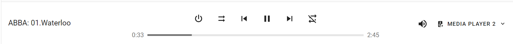
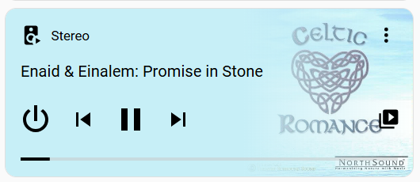
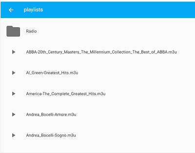
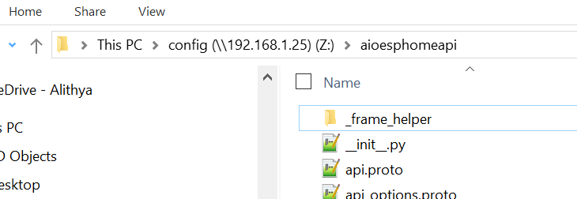
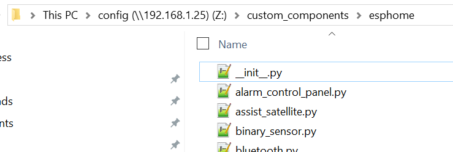
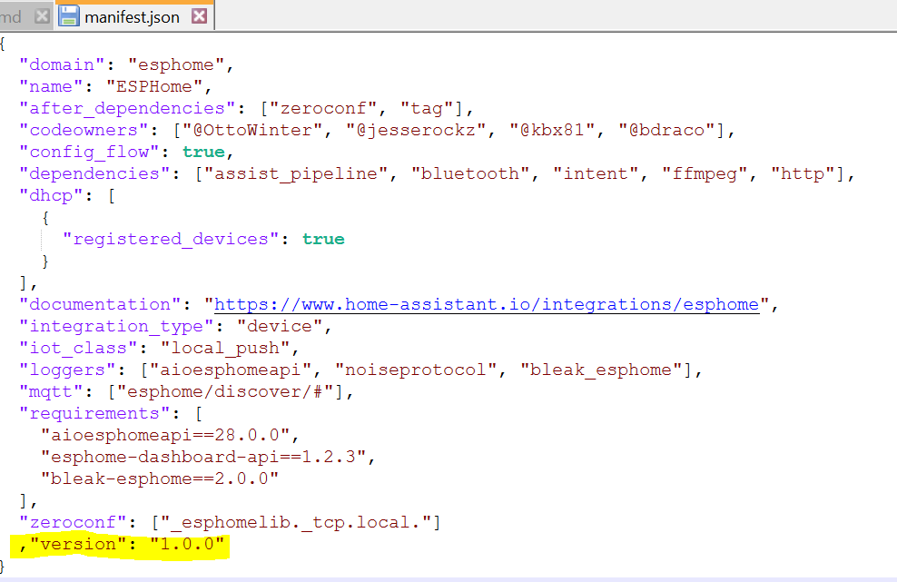
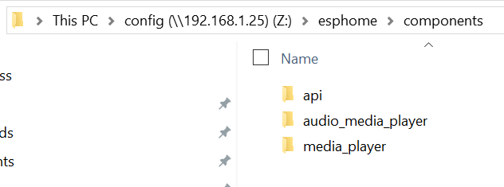

# ESPHome - Audio Media Player
## Install Version: ESPHome-2024.12.4, Core: 2025.2.0, ADF 2.7
This is the ADF 2.7 version.  It does not use i2s_audio because it is still using legacy driver while this code is using new i2s driver.
Lots of refactoring in this branch.
Removed Join/Unjoin, I'm not using it and not testing it, so removing it.
New optional variable: adf_pipeline_type
* SIMPLE (default) - single pipeline http reader, decoder, is2 writer
* COMPLEX - 3 pipelines that downmix any announcements into output.

Sibling Projects:
* https://github.com/rwrozelle/core
* * /homeassistant/components/esphome - required 
* * /homeassistant/components/jellyfin - optional to be able to play artists and albums from a jellyfin server
* * /homeassistant/components/media_source - use this if you are using dlna_dms and/ jellyfin

If you install Jellyfin custom component, when you open the Browse Media on Jellyfin, you'll notice that at the Artist and Album level, the Play button is available.

Jellyfin is an open source media-server: https://jellyfin.org/

* https://github.com/rwrozelle/esphome, the components api and media_player.
* https://github.com/rwrozelle/aioesphomeapi

This external component provides an audio media-player with the following HA Available services:
* turn_on - sends action on_turn_on
* turn_off - sends action on_turn_off
* toggle, 
* volume_up
* volume_down
* volume_set
* volume_mute
* media_play
* media_pause
* media_stop
* media_next_track
* media_previous_track
* clear_playlist
* shuffle_set
* repeat_set
* play_media - can turn an m3u file into a playlist
* * enqueue - add, next, play, replace
* * announce - after announcement is played, the current track is restarted

It also can optionally transcode using the ffmpeg server available as part of the ESPHome integration.
see the new attributes:
```
    # long lived bearer token, stored in esphome/secrets.yaml used to contact ffmpeg server for transcoding
    # if not provided, transcoding does not occur.
    transcode_access_token: !secret access_token 
    # ffmpeg server for transcoding, defaults to "http://homeassistant.local:8123" if not input.
    #transcode_server: http://homeassistant.local:8123
    # transcode target format: MP3, FLAC, WAV, or NONE, if NONE the transcoding does not occur.
    #transcode_format: FLAC
    # sample rate for transcoding, defaults to 44100
    transcode_sample_rate: 48000
```
Transcoding will strip metadata and embedded image that will mean smaller file transferred and less work by Pipeline in extracting track stream.








Audio Media Component uses [Espressif Audio Development Framework (ADF)](https://github.com/espressif/esp-adf) version 2.7

## External Component - audio-media-player
The esp-adf code is based on https://github.com/gnumpi/esphome_audio. Code is simplified to concentrate on above capabilities with the following components, note:  Only tested using this hardware:

1. ESP32-S3-DevKit1
2. I2S PCM5102 DAC Decoder

This component is built to solve the following use case:  Be able to play an extensive library of audo files available in a Jellyfin Server using standard HA Media functionality.



The code uses esp_decoder and is configured for the following:
Note: reduced the list to shrink size of flash image.

* DEFAULT_ESP_FLAC_DECODER_CONFIG(),
* DEFAULT_ESP_MP3_DECODER_CONFIG(),
* DEFAULT_ESP_WAV_DECODER_CONFIG(),

I've only used it with flac and mp3 files.  Recent increase in default http_stream ring buffer has improved flac file performance.

## Example Yaml
```
external_components:
  - source: components

esphome:
  name: media-player-1
  friendly_name: Media Player 1
  platformio_options:
    board_build.flash_mode: qio
    board_upload.maximum_size: 16777216
  libraries:
    - aioesphomeapi=file:///config/aioesphomeapi

esp32:
  board: esp32-s3-devkitc-1
  flash_size: 16MB
  framework:
    type: esp-idf
    sdkconfig_options:
      CONFIG_FREERTOS_ENABLE_BACKWARD_COMPATIBILITY: "y"
      CONFIG_ESP32_S3_BOX_BOARD: "y"

      CONFIG_ESP32_DEFAULT_CPU_FREQ_240: "y"
      CONFIG_ESP32_DEFAULT_CPU_FREQ_MHZ: "240"

     #tx is transmission, rx is read
      #Wi-Fi
      #If PSRAM is enabled, "Static" should be selected to guarantee enough WiFi TX buffers
      CONFIG_ESP_WIFI_STATIC_TX_BUFFER: "y"
      CONFIG_ESP_WIFI_TX_BUFFER_TYPE: "0"
      #default is 16 if CONFIG_ESP_WIFI_STATIC_TX_BUFFER
      CONFIG_ESP_WIFI_STATIC_TX_BUFFER_NUM: "8"
      #default is 0, caches the uplayer packets
      CONFIG_ESP_WIFI_CACHE_TX_BUFFER_NUM: "32"
      #default is 6
      #should not be larger than double of the CONFIG_ESP_WIFI_STATIC_RX_BUFFER_NUM
      #should not be larger than CONFIG_ESP_WIFI_DYNAMIC_RX_BUFFER_NUM
      CONFIG_ESP_WIFI_RX_BA_WIN: "16"
      #default 10, If ESP_WIFI_AMPDU_RX_ENABLED is enabled, this value is recommended to set equal or bigger than ESP_WIFI_RX_BA_WIN
      CONFIG_ESP_WIFI_STATIC_RX_BUFFER_NUM: "32"
      #default 32, If a dynamic RX buffer limit is set, it should be at least the number of static RX buffers
      #0 to 1024 if CONFIG_LWIP_WND_SCALE
      CONFIG_ESP_WIFI_DYNAMIC_RX_BUFFER_NUM: "512"
      
      #LWIP/TCP
      CONFIG_LWIP_WND_SCALE: "y"
      #default is 5760, max is 2440 to 1024000 if CONFIG_LWIP_WND_SCALE
      CONFIG_LWIP_TCP_WND_DEFAULT: "512000"
      #can't find a recommendation
      CONFIG_LWIP_TCP_RCV_SCALE: "3"
      #default 32, The value should be bigger than UDP/TCP mail box size.
      CONFIG_LWIP_TCPIP_RECVMBOX_SIZE: "512"
      #The recommended value is: LWIP_TCP_WND_DEFAULT/TCP_MSS + 2
      #default is 6, range is 0 to 1024 if CONFIG_LWIP_WND_SCALE
      CONFIG_LWIP_TCP_RECVMBOX_SIZE: "360"

psram:
 mode: octal
 speed: 80MHz

# Enable logging
logger:
  hardware_uart : UART0
  level: DEBUG
  logs:
    simple_adf_pipeline: WARN
    esp-idf: ERROR
    HTTPStreamReader: WARN

# Enable Home Assistant API
api:
  encryption:
    key: ""

ota:
  - platform: esphome
    password: ""

wifi:
  ssid: !secret wifi_ssid
  password: !secret wifi_password

# note: not using i2s_audio. Assumes this is the only i2s app running.  
audio_media_player:
    name: "Media Player 1"
    #either SIMPLE (default) or COMPLEX
    adf_pipeline_type: COMPLEX
    # long lived bearer token, stored in esphome/secrets.yaml used to contact ffmpeg server for transcoding
    # if not provided, transcoding does not occur.
    transcode_access_token: !secret access_token 
    # ffmpeg server for transcoding, defaults to "http://homeassistant.local:8123" if not input.
    #transcode_server: http://homeassistant.local:8123
    # transcode target format: MP3, FLAC, WAV, or NONE, if NONE the transcoding does not occur.
    #transcode_format: FLAC
    # sample rate for transcoding, defaults to 44100
    #transcode_sample_rate: 48000
    # defaults to 50 * 20 * 1024 = 1024000
    #http_stream_rb_size: 1024000
    # defaults to 10 * 1024 = 10240
    #esp_decoder_rb_size: 10240
    # defaults to 8 * 1024 = 8192
    #i2s_stream_rb_size: 8192
    # Modify pin based on physical wiring
    i2s_lrclk_pin: GPIO4
    i2s_bclk_pin: GPIO6
    i2s_dout_pin: GPIO5
    #below turns on and off a switch configured in HA, remove if not using.
    #on_turn_on:
    #  then:
    #    - logger.log: "Turn On Media Player 1"
    #    - homeassistant.service:
    #        service: switch.turn_on
    #        data:
    #          entity_id: switch.media_player_1_switch
    #on_turn_off:
    #  then:
    #    - logger.log: "Turn Off Media Player 1"
    #    - homeassistant.service:
    #        service: switch.turn_off
    #        data:
    #          entity_id: switch.media_player_1_switch
```

## Config Folder Structure (Same folder that contains configuration.yaml for HA)
```
config
  aioesphomeapi
  custom_components
    esphome
	jellyfin
	media-source
  esphome
    components
      api
      audio-media-player
      media-player
    media-player-1.yaml
    media-player-2.yaml
```

## Example m3u file
```
#EXTM3U
#EXTART:ABBA
#EXTALB:ABBA-20th Century Masters The Millennium Collection The Best of ABBA
#EXTINF:165,01.Waterloo
http://192.168.1.47:8000/music/mp3/ABBA/ABBA-20th_Century_Masters_The_Millennium_Collection_The_Best_of_ABBA/01.Waterloo.mp3
#EXTINF:203,02.S.O.S.
http://192.168.1.47:8000/music/mp3/ABBA/ABBA-20th_Century_Masters_The_Millennium_Collection_The_Best_of_ABBA/02.S.O.S..mp3
#EXTINF:197,03.I Do, I Do, I Do, I Do, I Do
http://192.168.1.47:8000/music/mp3/ABBA/ABBA-20th_Century_Masters_The_Millennium_Collection_The_Best_of_ABBA/03.I_Do,_I_Do,_I_Do,_I_Do,_I_Do.mp3
#EXTINF:214,04.Mamma Mia
http://192.168.1.47:8000/music/mp3/ABBA/ABBA-20th_Century_Masters_The_Millennium_Collection_The_Best_of_ABBA/04.Mamma_Mia.mp3
#EXTINF:255,05.Fernando
http://192.168.1.47:8000/music/mp3/ABBA/ABBA-20th_Century_Masters_The_Millennium_Collection_The_Best_of_ABBA/05.Fernando.mp3
#EXTINF:233,06.Dancing Queen
http://192.168.1.47:8000/music/mp3/ABBA/ABBA-20th_Century_Masters_The_Millennium_Collection_The_Best_of_ABBA/06.Dancing_Queen.mp3
#EXTINF:244,07.Knowing Me, Knowing You
http://192.168.1.47:8000/music/mp3/ABBA/ABBA-20th_Century_Masters_The_Millennium_Collection_The_Best_of_ABBA/07.Knowing_Me,_Knowing_You.mp3
#EXTINF:241,08.The Name of the Game
http://192.168.1.47:8000/music/mp3/ABBA/ABBA-20th_Century_Masters_The_Millennium_Collection_The_Best_of_ABBA/08.The_Name_of_the_Game.mp3
#EXTINF:246,09.Take a Chance on Me
http://192.168.1.47:8000/music/mp3/ABBA/ABBA-20th_Century_Masters_The_Millennium_Collection_The_Best_of_ABBA/09.Take_a_Chance_on_Me.mp3
#EXTINF:329,10.Chiquitita
http://192.168.1.47:8000/music/mp3/ABBA/ABBA-20th_Century_Masters_The_Millennium_Collection_The_Best_of_ABBA/10.Chiquitita.mp3
#EXTINF:294,11.The Winner Takes It All
http://192.168.1.47:8000/music/mp3/ABBA/ABBA-20th_Century_Masters_The_Millennium_Collection_The_Best_of_ABBA/11.The_Winner_Takes_It_All.mp3
```
or if using the custom Jellyfin integration, the temporary m3u file looks like this:
```
#EXTM3U

#EXTART:R.E.M.
#EXTALB:Reckoning
#EXTIMG:http://192.168.1.47:8096/Items/7d9c2d4520400b3dc05acf1899457c71/Images/Primary?MaxWidth=500&format=jpg&api_key=407997d8281345749c63c49546f0185c
#EXTINF:233,Harborcoat
http://192.168.1.47:8096/Audio/7d9c2d4520400b3dc05acf1899457c71/universal?UserId=12b28c0b77c54edfb412c9d4ea25db25&DeviceId=2c4c24c9f9d25b568776ec3df3b8b604&MaxStreamingBitrate=140000000&api_key=407997d8281345749c63c49546f0185c
#EXTART:R.E.M.
#EXTALB:Reckoning
#EXTIMG:http://192.168.1.47:8096/Items/91408279742bf4983159680b112f9593/Images/Primary?MaxWidth=500&format=jpg&api_key=407997d8281345749c63c49546f0185c
#EXTINF:258,7 Chinese Bros.
http://192.168.1.47:8096/Audio/91408279742bf4983159680b112f9593/universal?UserId=12b28c0b77c54edfb412c9d4ea25db25&DeviceId=2c4c24c9f9d25b568776ec3df3b8b604&MaxStreamingBitrate=140000000&api_key=407997d8281345749c63c49546f0185c
#EXTART:R.E.M.
#EXTALB:Reckoning
#EXTIMG:http://192.168.1.47:8096/Items/dd35024e9ef82726fe8b22d88e29a15e/Images/Primary?MaxWidth=500&format=jpg&api_key=407997d8281345749c63c49546f0185c
#EXTINF:196,So. Central Rain
http://192.168.1.47:8096/Audio/dd35024e9ef82726fe8b22d88e29a15e/universal?UserId=12b28c0b77c54edfb412c9d4ea25db25&DeviceId=2c4c24c9f9d25b568776ec3df3b8b604&MaxStreamingBitrate=140000000&api_key=407997d8281345749c63c49546f0185c
#EXTART:R.E.M.
#EXTALB:Reckoning
#EXTIMG:http://192.168.1.47:8096/Items/c20cdda7488510148aa41bad320be341/Images/Primary?MaxWidth=500&format=jpg&api_key=407997d8281345749c63c49546f0185c
#EXTINF:233,Pretty Persuasion
http://192.168.1.47:8096/Audio/c20cdda7488510148aa41bad320be341/universal?UserId=12b28c0b77c54edfb412c9d4ea25db25&DeviceId=2c4c24c9f9d25b568776ec3df3b8b604&MaxStreamingBitrate=140000000&api_key=407997d8281345749c63c49546f0185c
#EXTART:R.E.M.
#EXTALB:Reckoning
#EXTIMG:http://192.168.1.47:8096/Items/53bceae986171678e7bdba6ced396b03/Images/Primary?MaxWidth=500&format=jpg&api_key=407997d8281345749c63c49546f0185c
#EXTINF:212,Time After Time (Annelise)
http://192.168.1.47:8096/Audio/53bceae986171678e7bdba6ced396b03/universal?UserId=12b28c0b77c54edfb412c9d4ea25db25&DeviceId=2c4c24c9f9d25b568776ec3df3b8b604&MaxStreamingBitrate=140000000&api_key=407997d8281345749c63c49546f0185c
```
## Internet Radio m3u file
Only a small portion of internet radio stations play correctly, here is an example of a working station, ADF 2_7 appears to be able to play more radio stations than previously:
Using the transcoding to MP3 appears to really help with Radio stations.
```
#EXTM3U
#EXTINF:0,Jazz Groove - East
http://east-mp3-128.streamthejazzgroove.com/stream
```

## Play Media Enqueue
* replace - stops current track, clears playlist and plays provided file. If file is not an m3u, player creates a single track playlist.
* add - adds file to end of running playlist, if file is an m3u, then adds each track to the playlist.
* next - adds file to front of running playlist
* play - adds file to end of playlist and restarts.

## Announcements
Announcements are added to a separate "announcements" playlist and current playlist is stopped and all added announcements are played, then current track is restarted.

## Automation Scripts for use with Assist
These work if you install Jellyfin custom component, assumes there is only 1 media_player available in an area.
### Play Artist
```
alias: Conversation - Play Artist
description: ""
triggers:
  - command:
      - Play artist {artist}
    trigger: conversation
conditions: []
actions:
  - action: media_player.play_media
    metadata: {}
    data:
      media_content_id: media-source://jellyfin/?MusicArtist={{ trigger.slots.artist }}
      media_content_type: music
    target:
      area_id: "{{area_id(trigger.device_id) }}"
mode: single
```
### Play Album
```
alias: Conversation - Play Album
description: ""
triggers:
  - command:
      - Play album {album}
    trigger: conversation
conditions: []
actions:
  - action: media_player.play_media
    metadata: {}
    data:
      media_content_id: media-source://jellyfin/?MusicAlbum={{ trigger.slots.album }}
      media_content_type: music
    target:
      area_id: "{{area_id(trigger.device_id) }}"
mode: single
```

# Installation
This is how I install, there are other approaches:

1. Clone the following repositories.  For example, I've cloned them to C:\github
```
* C:\github\aioesphomeapi is a clone of https://github.com/rwrozelle/aioesphomeapi
* C:\github\audio-media-player is a clone of https://github.com/rwrozelle/audio-media-player
* C:\github\core is a clone of https://github.com/rwrozelle/core
* C:\github\esphome is a clone of https://github.com/rwrozelle/esphome
```

2. Use Samba share (https://github.com/home-assistant/addons/tree/master/samba) to create a mapped drive (Z:) to the Home Assistant __config__ folder

3. Copy C:\github\aioesphomeapi\aioesphomeapi to Z:\


4. If needed, create Z:\custom_components
5. Copy C:\github\core\homeassistant\components\esphome to Z:\custom_components


6. Modify Z:\custom_components\esphome\manifest.json and add:
  ,"version": "1.0.0"


7. If needed, create Z:\esphome\components
8. Copy C:\github\audio-media-player\esphome\components\audio_media_player to Z:\esphome\components
9. Copy C:\github\esphome\esphome\components\api to Z:\esphome\components
10. Copy C:\github\esphome\esphome\components\media_player to Z:\esphome\components

11. Restart HA, In the raw log file will be the entry:
```
WARNING (SyncWorker_0) [homeassistant.loader] We found a custom integration esphome which has not been tested by Home Assistant. This component might cause stability problems, be sure to disable it if you experience issues with Home Assistant
```
This means that HA is using code in Z:\custom_components\esphome, not the code that comes with HA Release.

12. Build your ESPHome device using the Example Yaml as a guide.

13. If you want to use jellyfin to play albums or even entire artists, you can:
* Copy C:\github\core\homeassistant\components\media_source to Z:\custom_components
* Copy C:\github\core\homeassistant\components\jellyfin to Z:\custom_components
* Modify Z:\custom_components\media_source\manifest.json and add:
  ,"version": "1.0.0"
* Modify Z:\custom_components\jellyfin\manifest.json and add:
  ,"version": "1.0.0"
