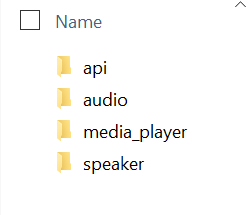

Custom Speaker Audio Media Player
==========================
Tagged Releases for ADF 2.7 and ADF 2.6 are available but no further maintenance is occuring in this github project.

Playlist functionality is now a custom extension of speaker/media_player in https://github.com/rwrozelle/esphome

This project documents the custom extensions and how to install.

Github Projects
------------------------
- https://github.com/rwrozelle/core
- - /homeassistant/components/esphome - required 
- - /homeassistant/components/jellyfin - optional to be able to play artists and albums from a jellyfin server
- - /homeassistant/components/media_source - use this if you are using jellyfin.  If you install Jellyfin custom component, when you open the Browse Media on Jellyfin, you'll notice that at the Artist and Album level, the Play button is available.  Jellyfin is an open source media-server: https://jellyfin.org/
- https://github.com/rwrozelle/esphome, the components api, audio, media_player, and speaker.
- https://github.com/rwrozelle/aioesphomeapi

Additional Services to speaker/media_player
------------------------
- turn_on - sends action on_turn_on
- turn_off - sends action on_turn_off
- media_next_track
- media_previous_track
- shuffle_set
- repeat_set (off, one, or all)
- play_media - can turn an m3u file into a playlist (https://en.wikipedia.org/wiki/M3U)
- - enqueue - media pipeline: add, next, play, replace, no change to announce_pipeline behavior
- - announce - no change to announce_pipeline behavior

Additional Configuration Variables to speaker/media_player
------------------------
- **off_on_enabled** (*Optional* boolean): Enable Turn on and Turn off services including automation. Defaults to ``false``.
- **next_previous_track_enabled** (*Optional* boolean): Enable Media Next Track and Media Previous Track. Defaults to ``false``.
- **transcode_access_token** (*Optional* string): Alphanumeric long lived token.  Defaults to empty string. (https://developers.home-assistant.io/docs/auth_api/#long-lived-access-token)
- **transcode_server** - (*Optional* string):Host and Port of Transcode Server, defaults to ``http://homeassistant.local:8123``.  This is the same ffmpeg proxy used by standard speaker/media_player functionality.

Discusion
------------------------
The extended functionality requires that a *media_pipeline* be configured
Enabling Off/On is useful for a media player that needs to turn on/turn off an amplifier
Enabling Next/Previous Track allows for the use of M3U files.  
The Artist, Album, Title, Duration, Media URL, and Thumbnail URL can be extracted from the M3U file for each track and are sent back to Home Assistant
for display in the Media Player cards.


*All testing occurred using the following*
1. ESP32-S3-DevKit1 (N16R8)
2. I2S PCM5102 DAC Decoder
3. M3U files containing FLAC urls that at run-time are transcoded via the transcode server.

These extensions were developed to solve the following use case:  Be able to play an extensive library of audo files available in a Jellyfin Server using standard HA Media functionality.


Example Configuration
------------------------
Below is stub showing the changes from speaker\media_player documentation.
```
external_components:
  - source: components
...
media_player:
  - platform: speaker
    name: "Speaker Media Player"
    id: speaker_media_player_id
    off_on_enabled: True
    next_previous_track_enabled: True
    transcode_access_token: !secret access_token
...
```
access token was manually placed in secrets.yaml

Installation
------------------------
This is how I install, there are other approaches:

1. Clone the following repositories.  For example, I've cloned them to C:\github
```
C:\github\aioesphomeapi is a clone of https://github.com/rwrozelle/aioesphomeapi
C:\github\core is a clone of https://github.com/rwrozelle/core
C:\github\esphome is a clone of https://github.com/rwrozelle/esphome
```

2. Use Samba share (https://github.com/home-assistant/addons/tree/master/samba) to create a mapped drive (Z:) to the Home Assistant __config__ folder

3. Copy C:\github\aioesphomeapi\aioesphomeapi to Z:\


4. If needed, create Z:\custom_components
5. Copy C:\github\core\homeassistant\components\esphome to Z:\custom_components


6. Modify Z:\custom_components\esphome\manifest.json and add:
  ,"version": "1.0.0"


7. If needed, create Z:\esphome\components
8. Copy C:\github\esphome\esphome\components\api to Z:\esphome\components
9. Copy C:\github\esphome\esphome\components\audio to Z:\esphome\components
10. Copy C:\github\esphome\esphome\components\media_player to Z:\esphome\components
11. Copy C:\github\esphome\esphome\components\speaker to Z:\esphome\components

12. Restart HA, In the raw log file will be the entry:
```
WARNING (SyncWorker_0) [homeassistant.loader] We found a custom integration esphome which has not been tested by Home Assistant. This component might cause stability problems, be sure to disable it if you experience issues with Home Assistant
```
This means that HA is using code in Z:\custom_components\esphome, not the code that comes with HA Release.

13. Build your ESPHome device using the Example Yaml as a guide.

14. If you want to use jellyfin to play albums or even entire artists, you can:
* Copy C:\github\core\homeassistant\components\media_source to Z:\custom_components
* Copy C:\github\core\homeassistant\components\jellyfin to Z:\custom_components
* Modify Z:\custom_components\media_source\manifest.json and add:
  ,"version": "1.0.0"
* Modify Z:\custom_components\jellyfin\manifest.json and add:
  ,"version": "1.0.0"

You should end up with a folder structure that looks similar to this:
```
config
  aioesphomeapi
  custom_components
    esphome
    jellyfin
    media-source
  esphome
    components
      api
      audio-media-player
      media-player
    media-player-1.yaml
    media-player-2.yaml
```

Example M3U File
------------------------
```
#EXTM3U
#EXTART:ABBA
#EXTALB:ABBA-20th Century Masters The Millennium Collection The Best of ABBA
#EXTINF:165,01.Waterloo
http://192.168.1.47:8000/music/mp3/ABBA/ABBA-20th_Century_Masters_The_Millennium_Collection_The_Best_of_ABBA/01.Waterloo.mp3
#EXTINF:203,02.S.O.S.
http://192.168.1.47:8000/music/mp3/ABBA/ABBA-20th_Century_Masters_The_Millennium_Collection_The_Best_of_ABBA/02.S.O.S..mp3
#EXTINF:197,03.I Do, I Do, I Do, I Do, I Do
http://192.168.1.47:8000/music/mp3/ABBA/ABBA-20th_Century_Masters_The_Millennium_Collection_The_Best_of_ABBA/03.I_Do,_I_Do,_I_Do,_I_Do,_I_Do.mp3
#EXTINF:214,04.Mamma Mia
http://192.168.1.47:8000/music/mp3/ABBA/ABBA-20th_Century_Masters_The_Millennium_Collection_The_Best_of_ABBA/04.Mamma_Mia.mp3
#EXTINF:255,05.Fernando
http://192.168.1.47:8000/music/mp3/ABBA/ABBA-20th_Century_Masters_The_Millennium_Collection_The_Best_of_ABBA/05.Fernando.mp3
#EXTINF:233,06.Dancing Queen
http://192.168.1.47:8000/music/mp3/ABBA/ABBA-20th_Century_Masters_The_Millennium_Collection_The_Best_of_ABBA/06.Dancing_Queen.mp3
#EXTINF:244,07.Knowing Me, Knowing You
http://192.168.1.47:8000/music/mp3/ABBA/ABBA-20th_Century_Masters_The_Millennium_Collection_The_Best_of_ABBA/07.Knowing_Me,_Knowing_You.mp3
#EXTINF:241,08.The Name of the Game
http://192.168.1.47:8000/music/mp3/ABBA/ABBA-20th_Century_Masters_The_Millennium_Collection_The_Best_of_ABBA/08.The_Name_of_the_Game.mp3
#EXTINF:246,09.Take a Chance on Me
http://192.168.1.47:8000/music/mp3/ABBA/ABBA-20th_Century_Masters_The_Millennium_Collection_The_Best_of_ABBA/09.Take_a_Chance_on_Me.mp3
#EXTINF:329,10.Chiquitita
http://192.168.1.47:8000/music/mp3/ABBA/ABBA-20th_Century_Masters_The_Millennium_Collection_The_Best_of_ABBA/10.Chiquitita.mp3
#EXTINF:294,11.The Winner Takes It All
http://192.168.1.47:8000/music/mp3/ABBA/ABBA-20th_Century_Masters_The_Millennium_Collection_The_Best_of_ABBA/11.The_Winner_Takes_It_All.mp3
```
or if using the custom Jellyfin integration, the temporary m3u file passed to the SOC looks Similar to this:
```
#EXTM3U

#EXTART:R.E.M.
#EXTALB:Reckoning
#EXTIMG:http://192.168.1.47:8096/Items/7d9c2d4520400b3dc05acf1899457c71/Images/Primary?MaxWidth=500&format=jpg&api_key=407997d8281345749c63c49546f0185c
#EXTINF:233,Harborcoat
http://192.168.1.47:8096/Audio/7d9c2d4520400b3dc05acf1899457c71/universal?UserId=12b28c0b77c54edfb412c9d4ea25db25&DeviceId=2c4c24c9f9d25b568776ec3df3b8b604&MaxStreamingBitrate=140000000&api_key=407997d8281345749c63c49546f0185c
#EXTART:R.E.M.
#EXTALB:Reckoning
#EXTIMG:http://192.168.1.47:8096/Items/91408279742bf4983159680b112f9593/Images/Primary?MaxWidth=500&format=jpg&api_key=407997d8281345749c63c49546f0185c
#EXTINF:258,7 Chinese Bros.
http://192.168.1.47:8096/Audio/91408279742bf4983159680b112f9593/universal?UserId=12b28c0b77c54edfb412c9d4ea25db25&DeviceId=2c4c24c9f9d25b568776ec3df3b8b604&MaxStreamingBitrate=140000000&api_key=407997d8281345749c63c49546f0185c
#EXTART:R.E.M.
#EXTALB:Reckoning
#EXTIMG:http://192.168.1.47:8096/Items/dd35024e9ef82726fe8b22d88e29a15e/Images/Primary?MaxWidth=500&format=jpg&api_key=407997d8281345749c63c49546f0185c
#EXTINF:196,So. Central Rain
http://192.168.1.47:8096/Audio/dd35024e9ef82726fe8b22d88e29a15e/universal?UserId=12b28c0b77c54edfb412c9d4ea25db25&DeviceId=2c4c24c9f9d25b568776ec3df3b8b604&MaxStreamingBitrate=140000000&api_key=407997d8281345749c63c49546f0185c
#EXTART:R.E.M.
#EXTALB:Reckoning
#EXTIMG:http://192.168.1.47:8096/Items/c20cdda7488510148aa41bad320be341/Images/Primary?MaxWidth=500&format=jpg&api_key=407997d8281345749c63c49546f0185c
#EXTINF:233,Pretty Persuasion
http://192.168.1.47:8096/Audio/c20cdda7488510148aa41bad320be341/universal?UserId=12b28c0b77c54edfb412c9d4ea25db25&DeviceId=2c4c24c9f9d25b568776ec3df3b8b604&MaxStreamingBitrate=140000000&api_key=407997d8281345749c63c49546f0185c
#EXTART:R.E.M.
#EXTALB:Reckoning
#EXTIMG:http://192.168.1.47:8096/Items/53bceae986171678e7bdba6ced396b03/Images/Primary?MaxWidth=500&format=jpg&api_key=407997d8281345749c63c49546f0185c
#EXTINF:212,Time After Time (Annelise)
http://192.168.1.47:8096/Audio/53bceae986171678e7bdba6ced396b03/universal?UserId=12b28c0b77c54edfb412c9d4ea25db25&DeviceId=2c4c24c9f9d25b568776ec3df3b8b604&MaxStreamingBitrate=140000000&api_key=407997d8281345749c63c49546f0185c
```
To Easily run an Internet Radio Station, you an create M3U files in local media source
```
#EXTM3U
#EXTINF:0,Jazz Groove - East
http://east-mp3-128.streamthejazzgroove.com/stream
```

Example Automation Scripts
------------------------
These work if you install Jellyfin custom component, assumes there is only 1 media_player available in an area.
### Play Artist
```
alias: Conversation - Play Artist
description: ""
triggers:
  - command:
      - Play artist {artist}
    trigger: conversation
conditions: []
actions:
  - action: media_player.shuffle_set
    metadata: {}
    target:
      area_id: "{{area_id(trigger.device_id) }}"
    data:
      shuffle: false
  - action: media_player.play_media
    metadata: {}
    data:
      media_content_id: media-source://jellyfin/?MusicArtist={{ trigger.slots.artist }}
      media_content_type: music
    target:
      area_id: "{{area_id(trigger.device_id) }}"
mode: single
```
### Play Shuffled Artist
```
alias: Conversation - Play Shuffled Artist
description: ""
triggers:
  - command:
      - Play shuffled artist {artist}
    trigger: conversation
conditions: []
actions:
  - action: media_player.shuffle_set
    metadata: {}
    target:
      area_id: "{{area_id(trigger.device_id) }}"
    data:
      shuffle: true
  - action: media_player.play_media
    metadata: {}
    data:
      media_content_id: media-source://jellyfin/?MusicArtist={{ trigger.slots.artist }}
      media_content_type: music
    target:
      area_id: "{{area_id(trigger.device_id) }}"
mode: single
```
### Play Album
```
alias: Conversation - Play Album
description: ""
triggers:
  - command:
      - Play album {album}
    trigger: conversation
conditions: []
actions:
  - action: media_player.play_media
    metadata: {}
    data:
      media_content_id: media-source://jellyfin/?MusicAlbum={{ trigger.slots.album }}
      media_content_type: music
    target:
      area_id: "{{area_id(trigger.device_id) }}"
mode: single
```
